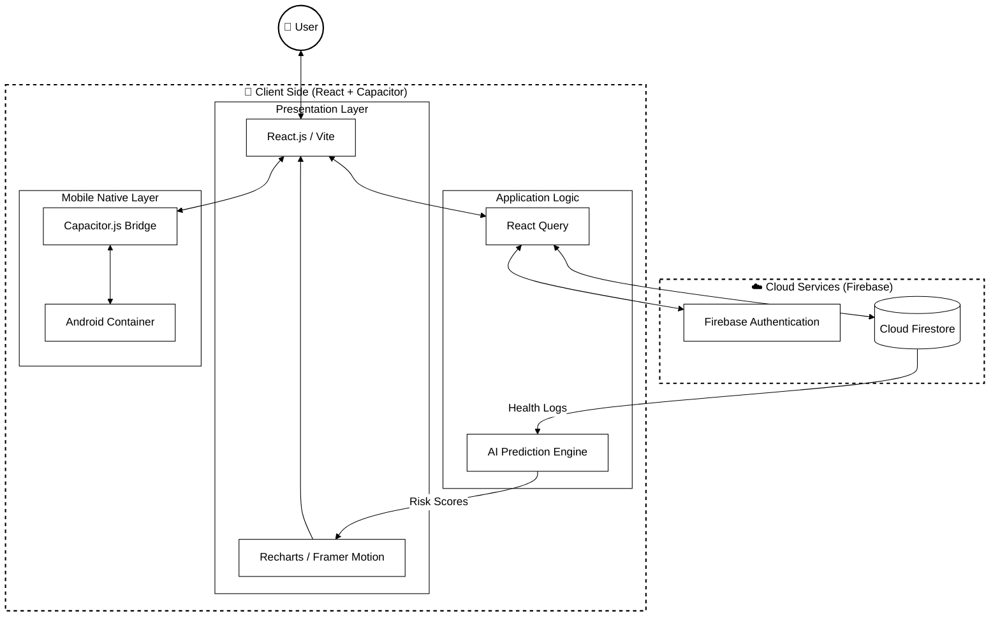

# Sumo-Guard System Architecture

This document contains the high-level system architecture of the Sumo-Guard application, including the interaction between the frontend, the analytical core, and the cloud infrastructure.

## Prompt for ChatGPT

> **Prompt:**
> Act as a Solution Architect. Generate a high-level System Architecture Diagram for the 'Sumo-Guard' cross-platform health application.
> 
> **Requirements:**
> 1. **Layers:** 
>    - **Presentation Layer:** React, Vite, Tailwind CSS, Recharts.
>    - **Logic Layer:** React Query, Prediction Engine (Local).
>    - **Infrastructure Layer:** Firebase Auth, Firestore.
>    - **Nativization:** Capacitor.js, Android Container.
> 2. **Interactions:** Show how data flows from Firestore to the Prediction Engine and then to the UI.
> 3. **Visual Style:** Professional **Black and White** (monochrome) format.
> 4. **Output:** Provide the Mermaid code.

---

## System Architecture Diagram (Mermaid)

This diagram is rendered in high-contrast black and white, showing the structural layers of the application.

## Architectural Components

1.  **Presentation Layer**: Built with **React** and **Vite** for maximum performance. **Tailwind CSS** provides a premium UI, while **Recharts** handles the health data visualization.
2.  **Logic Layer**: 
    *   **React Query**: Manages server state, caching, and background data synchronization.
    *   **AI Prediction Engine**: A local analytical module that processes health data to calculate disease risks.
3.  **Infrastructure Layer**: 
    *   **Firebase Authentication**: Handles secure user sessions.
    *   **Cloud Firestore**: A NoSQL database that stores time-series health logs and user profiles.
4.  **Mobile Layer**: **Capacitor.js** acts as a bridge, allowing the web codebase to run natively on **Android**.
