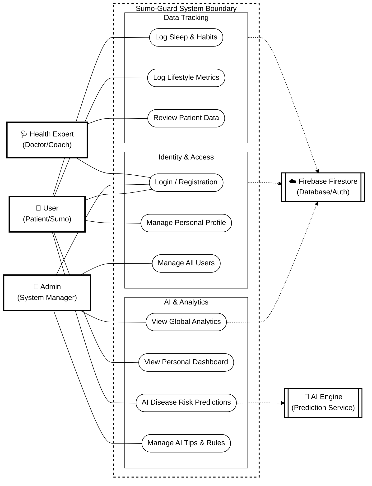
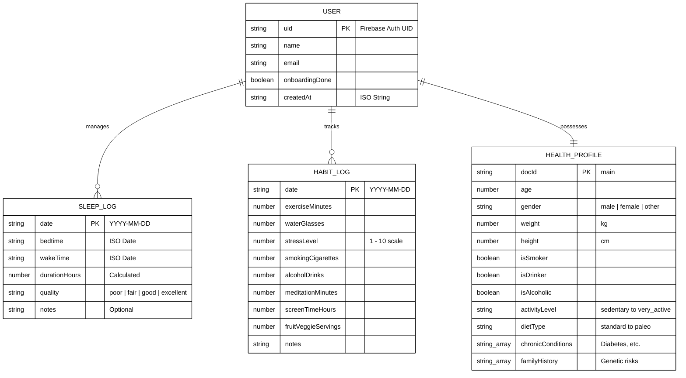

# Sumo-Guard System Architecture Documentation

This document contains the definitive Use Case and Entity-Relationship (ER) diagrams for the Sumo-Guard health tracking system. It includes all granular features (proper features) and clearly identifies all Actors.

## ChatGPT Prompt for UML Export

> **Prompt:**
> Act as a Senior Systems Architect. Generate a formal UML documentation for the 'Sumo-Guard' health application in PlantUML format.
> 
> **Specifications:**
> 1. **Use Case Diagram:** 
>    - **Primary Actor:** User (Stick figure on the left).
>    - **Secondary Actor:** Firebase Firestore (Box on the right).
>    - **System Boundary:** 'Sumo-Guard Application'.
>    - **Features:** Authentication, Detailed Onboarding, Habit Logging (Water, Exercise, Stress), Sleep Tracking, AI Disease Predictions (including contributing factors), and Health Statistics (filtered by day/month).
> 2. **ER Diagram:** 
>    - **Entities:** User, Sleep_Log, Habit_Log, Health_Profile.
>    - **Relationships:** One-to-Many for logs, One-to-One for Profile.
>    - **Attributes:** All fields including boolean flags and calculation fields.
> 3. **Format:** Monochrome (Black and White) with professional styling.

---

## 1. Professional Use Case Diagram

This diagram separates the User from the System and shows how the application interacts with external services (Firebase).

---

## 2. Professional ER Model Diagram

A complete representation of the database schema, including all attributes and relationships.

## Summary of Proper Features

1.  **Actor Identification**: 
    *   **User**: The primary patient/user tracking their health.
    *   **Admin**: System manager responsible for user moderation and system-wide stats.
    *   **Health Expert**: A secondary role for doctors or coaches to review anonymized or shared patient data.
    *   **Firebase / AI Engine**: External services providing infrastructure and intelligence.
2.  **Admin & Other Flows**: 
    *   **Manage All Users**: Admin capability to oversee the user base.
    *   **Global Analytics**: Aggregated system-wide data (non-personal).
    *   **Expert Review**: Interface for professionals to provide feedback or review logs.
3.  **CRUD Operations**: Explicitly shows that logs can be added, viewed, and deleted.
4.  **Schema Completeness**: The ER model includes derived fields like `durationHours` and onboarding flags like `onboardingDone`.
